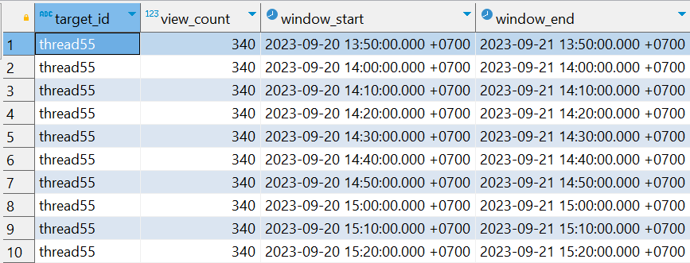

# Streaming Analytics With RisingWave and dbt
In today's data-driven world, the ability to harness real-time data for actionable insights is paramount. This repository serves as your gateway to mastering the art of streaming analytics using two powerful tools: RisingWave and dbt.

This repository is a comprehensive resource for hands-on demos, code examples, all aimed at guiding you through the exciting journey of building a robust streaming analytics framework.


# Clickstream analysis demo
Whether a website experiences daily traffic in the hundreds or millions, clickstream data offers valuable insights through various website metrics. This data not only provides insights into a page's popularity but also serves as an effective alternative to traditional market research methodologies. It allows us to assess the efficacy of digital marketing campaigns, UX design, and more by analyzing user behaviors, obviating the need for conventional surveys.

Clickstream data offers a detailed record of users' journeys through a website. It reveals the duration users spend on specific pages, their entry points, and subsequent interactions. If a significant number of users swiftly exit a page, it suggests the need for improvements to enhance user engagement.

In this tutorial, you will discover how to track the evolving click count of a webpage using RisingWave. We've established a demo cluster for your convenience, making it easy for you to experiment with these concepts.


# The Content
- [Connect RisingWave to data streams](#connect-risingwave-to-data-streams)
- [Understanding the Tools](#understanding-the-tools)
- [Set up the RisingWave, dbt with Docker Compose](set-up-risingwave-dbt-with-docker-compose)
- [Create a dbt project for streaming analytics](#create-a-dbt-project-for-streaming-analytics)
- [Conclusion](#conclusion)
- [Supporting Links](#supporting-links)


## Understanding the Tools
### RisingWave
RisingWave is a **distributed SQL database** for **stream processing**. It is designed to reduce the complexity and cost of building real-time applications. RisingWave consumes streaming data, performs incremental computations when new data comes in, and updates results dynamically. As a database system, RisingWave maintains results in its own storage so that users can access data efficiently.
RisingWave accepts data from sources like Apache Kafka, Apache Pulsar, Amazon Kinesis, Redpanda, and materialized CDC sources.

### dbt
dbt, which stands for Data Build Tool, is a command-line tool that revolutionizes the way data transformations and modeling are done. Here's a deeper dive into dbt's capabilities:

- **Modular Data Transformations**: dbt uses SQL and YAML files to define data transformations and models. This modular approach allows you to break down complex transformations into smaller, more manageable pieces, enhancing mantainability and version control.
- **Data Testing**: dbt facilitates data testing by allowing you to define expectations about your data. It helps ensure data quality by automatically running tests against your transformed data.
- **Version Control**: dbt projects can be version controlled with tools like Git, enabling collaboration among data professionals while keeping a history of changes.
- **Incremental Builds**: dbt supports incremental builds, meaning it only processes data that has changed since the last run. This feature saves time and resources when working with large datasets.
- **Orchestration**: While dbt focuses on data transformations and modeling, it can be integrated with orchestration tools like Apache Airflow or dbt Cloud to create automated data pipelines.

## Set up the RisingWave, dbt with Docker Compose
### Pre-requisites
To follow along, you need to:

- **Install Docker and Docker Compose in your machine**. You can follow [this guide](https://docs.docker.com/engine/install/?_gl=1*187dp4*_ga*MTAzNDgyNDI0My4xNjkzNDY2NDcy) to install Docker and [this one](https://docs.docker.com/compose/install/?_gl=1*187dp4*_ga*MTAzNDgyNDI0My4xNjkzNDY2NDcy) to install Docker Compose.

This tutorial uses Docker Compose and a shell script to set up the required resources. Docker saves you from installing additional dependencies local. You can quickly start and stop the instances.

### Set up the RisingWave
The compose file is stored in `risingwave/docker-compose.yml` that import the base compose file stored in `risingwave\docker\base-docker-compose.yml`. . You can go through these files and make any necessary customization, for example, changing the ports where the instances start or installing additional dependencies. You can go through these files and make any necessary customization, for example, changing the ports where the instances start or installing additional dependencies.

```yaml
version: "3"
services:
  compactor-0:
    extends:
      file: ./docker/base-docker-compose.yml
      service: compactor-0
  compute-node-0:
    extends:
      file: ./docker/base-docker-compose.yml
      service: compute-node-0
  etcd-0:
    extends:
      file: ./docker/base-docker-compose.yml
      service: etcd-0
  frontend-node-0:
    extends:
      file: ./docker/base-docker-compose.yml
      service: frontend-node-0
  grafana-0:
    extends:
      file: ./docker/base-docker-compose.yml
      service: grafana-0
  meta-node-0:
    extends:
      file: ./docker/base-docker-compose.yml
      service: meta-node-0
  minio-0:
    extends:
      file: ./docker/base-docker-compose.yml
      service: minio-0
  prometheus-0:
    extends:
      file: ./docker/base-docker-compose.yml
      service: prometheus-0
  message_queue:
    extends:
      file: ./docker/base-docker-compose.yml
      service: message_queue
  datagen:
    build: ./datagen
    depends_on: [message_queue]
    command:
      - /bin/sh
      - -c
      - /datagen --mode clickstream --qps 2 kafka --brokers message_queue:29092
    restart: always
    container_name: datagen
volumes:
  compute-node-0:
    external: false
  etcd-0:
    external: false
  grafana-0:
    external: false
  minio-0:
    external: false
  prometheus-0:
    external: false
  message_queue:
    external: false
name: risingwave-compose
```
In this guide, we use a `datagen` program written in `go` language to generate sample clickstream data.

```yaml
  datagen:
    build: ./datagen
    depends_on: [message_queue]
    command:
      - /bin/sh
      - -c
      - /datagen --mode clickstream --qps 2 kafka --brokers message_queue:29092
    restart: always
    container_name: datagen
```

## Connect RisingWave to data streams
After configuring the data stream in Redpanda with JSON format using the demonstration cluster, we can establish a connection to the streams using the following SQL statement. This data stream includes details about user interactions, including what each user is clicking on and the corresponding event timestamps.

```sql
CREATE SOURCE user_behaviors (
    user_id VARCHAR,
    target_id VARCHAR,
    target_type VARCHAR,
    event_timestamp TIMESTAMPTZ, --NOTE: Fix: change from TimeStamp
    behavior_type VARCHAR,
    parent_target_type VARCHAR,
    parent_target_id VARCHAR
) WITH (
    connector = 'kafka',
    topic = 'user_behaviors',
    properties.bootstrap.server = 'message_queue:29092',
    scan.startup.mode = 'earliest'
) FORMAT PLAIN ENCODE JSON;
```

## Create a dbt project for streaming analytics
### Install dbt-risingwave adapter
The first step is to install the `dbt-risingwave` adapter. You can do this by running the following commands:
```shell
# create a virtual environment
cd dbt
python -m venv .env
source .env/bin/activate

# install dbt-core and dbt-risingwave
pip install -r requirements.txt
```

### Init dbt project
The second step is to initialize a dbt project with the `risingwave_demo` name by running following commands:
```shell
# create dbt project with risisingwave name
# input parameters to set up a profile to connect to the local RisingWave:
# - host: 127.0.0.1
# - port: 4566
# - user: root
dbt init risingwave_demo
# check that the adapter is installed successfully
cd risingwave_demo
dbt debug --profiles-dir .
```

The content of the `profiles.yml` is as below:
```yaml
risingwave_demo:
  outputs:
    dev:
      dbname: dev
      host: 127.0.0.1
      password: ''
      port: 4566
      schema: public
      threads: 1
      type: risingwave
      user: root
  target: dev
```

### Create a source
The next step is to create a source that corresponds with the `user_behaviors` SOURCE created on the RisingWave database previously.
The content is defined in the `risingwave_demo\models\source.yml` file.
```yaml
sources:
  - name: dev_public_source
    database: dev
    schema: public
    tables:
      - name: user_behaviors
```

### Define materialized views and query the results
Finally, we will create some analytics models. In this guide, we will create a materialized view that counts the number of times a thread was clicked on over a day.

First, the `tumble()` function will map each event into a 10-minute window to create an intermediary `table t`, where the events will be aggregated on `target_id` and `window_time` to get the number of clicks for each thread. The events will also be filtered by `target_type` and `behavior_type`.

Next, the `hop()` function will create `24-hour` time windows every `10 minutes`. Each event will be mapped to corresponding windows. Finally, they will be grouped by `target_id` and `window_time` to calculate the total number of clicks of each thread within `24 hours`.

The content of the model should be like this:
```sql

{{ config(materialized='materializedview') }}

WITH t AS (
    SELECT
        target_id,
        COUNT() AS view_count,
        window_start AS window_time
    FROM
        TUMBLE(
            {{ source('dev_public_source', 'user_behaviors') }},
            event_timestamp,
            INTERVAL '10 minutes'
        )
    WHERE
        target_type = 'thread'
        AND behavior_type = 'show'
    GROUP BY
        target_id,
        window_start
)
SELECT
    target_id,
    SUM(t.view_count) AS view_count,
    window_start,
    window_end
FROM
    HOP(
            t,
            t.window_time,
            INTERVAL '10 minutes',
            INTERVAL '1440 minutes' -- 24 hours
        )
GROUP BY
    target_id,
    window_start,
    window_end
```

Note: RisingWave accepts these four materializations:
- `table`: Create a table. 
- `view`: Create a view.
- `ephemeral`: This materialization uses `common table expressions` in RisingWave under the hood.
- `materializedview`: Create a materialized view. This materialization is corresponding to the `incremental` one in dbt. Since RisingWave is designed to use materialized view to manage data transformation in an incremental way, you don’t need to use the `incremental` materialization and can just use `materializedview`.

### Query the results
You can query the most often viewed threads using the following SQL statement in a SQL client tool:

```sql
SELECT * FROM thread_view_count
ORDER BY view_count DESC, window_start
LIMIT 10;
```

The results should be like this:

<p>
    
</p>

Alternatively, you can use the `dbt show` command:

```shell
dbt show --profiles-dir . --inline "select * from thread_view_count limit 10"

06:48:21  Running with dbt=1.5.6
06:48:22  Registered adapter: risingwave=1.5.1
06:48:26  [WARNING]: Configuration paths exist in your dbt_project.yml file which do not apply to any resources.
There are 1 unused configuration paths:
- models.risingwave_demo.example
06:48:26  Found 1 model, 0 tests, 0 snapshots, 0 analyses, 320 macros, 0 operations, 0 seed files, 1 source, 0 exposures, 0 metrics, 0 groups
06:48:26
06:48:26  Concurrency: 1 threads (target='dev')
06:48:26
06:48:27  Previewing inline node:
| target_id | view_count |         window_start |           window_end |
| --------- | ---------- | -------------------- | -------------------- |
| thread0   |        138 | 2023-09-19 21:20:... | 2023-09-20 21:20:... |
| thread0   |        185 | 2023-09-19 23:40:... | 2023-09-20 23:40:... |
| thread0   |        296 | 2023-09-20 04:40:... | 2023-09-21 04:40:... |
| thread0   |        308 | 2023-09-20 05:20:... | 2023-09-21 05:20:... |
| thread0   |        308 | 2023-09-20 05:30:... | 2023-09-21 05:30:... |
```

# Conclusion
In conclusion, the synergy between RisingWave and dbt presents an exciting opportunity to streamline the development of a robust and efficient streaming analytics platform.

RisingWave's simplicity and potential performance enhancements, when combined with dbt's powerful data transformation capabilities, create a compelling ecosystem. This partnership enables organizations to build a streaming analytics platform that not only processes data seamlessly but also allows for sophisticated data modeling, transformation, and analytics.

By leveraging RisingWave's strengths in stream processing and dbt's proficiency in data modeling, organizations can achieve a more agile and effective approach to real-time analytics. This combination empowers teams to rapidly develop, iterate, and deploy streaming analytics solutions while maintaining data quality and consistency.

In essence, the integration of RisingWave and dbt offers a holistic solution for organizations seeking to harness the power of real-time data analytics, making it easier and more effective to derive valuable insights from streaming data sources.

While RisingWave is touted for its potential performance improvements, it's important to note that we have not yet confirmed the extent of these enhancements. Initial indications suggest a promising outlook: stateless computing appears to offer a significant boost, ranging from 10% to 30%, while stateful computing shows the potential for an astonishing 10-fold or greater improvement.

To gain a more comprehensive understanding of RisingWave's performance capabilities, we eagerly anticipate the forthcoming performance report. Regardless, in the realm of stream processing, the combination of simplicity and performance remains a valuable asset, and RisingWave demonstrates its commitment to delivering on both fronts and more.

# Supporting Links
* <a href="https://www.risingwave.com/blog/rethinking-stream-processing-and-streaming-databases/" target="_blank">Rethinking Stream Processing and Streaming Databases</a>
* <a href="https://docs.risingwave.com/docs/current/use-dbt/" target="_blank">Use dbt for data transformations</a>
* <a href="https://docs.risingwave.com/docs/current/clickstream-analysis/" target="_blank">Clickstream analysis</a>
* <a href="https://www.clouddatainsights.com/real-time-olap-databases-and-streaming-databases-a-comparison/" target="_blank">Real-time OLAP Databases and Streaming Databases: A Comparison</a>
* <a href="https://www.risingwave.com/blog/start-your-stream-processing-journey-with-just-4-lines-of-code/" target="_blank">Start Your Stream Processing Journey With Just 4 Lines of Code</a>
* <a href="https://medium.com/@RisingWave_Engineering/top-8-streaming-databases-for-real-time-analytics-a-comprehensive-guide-f45d7b3b35c8" target="_blank">Top 8 Streaming Databases for Real-Time Analytics: A Comprehensive Guide</a>


